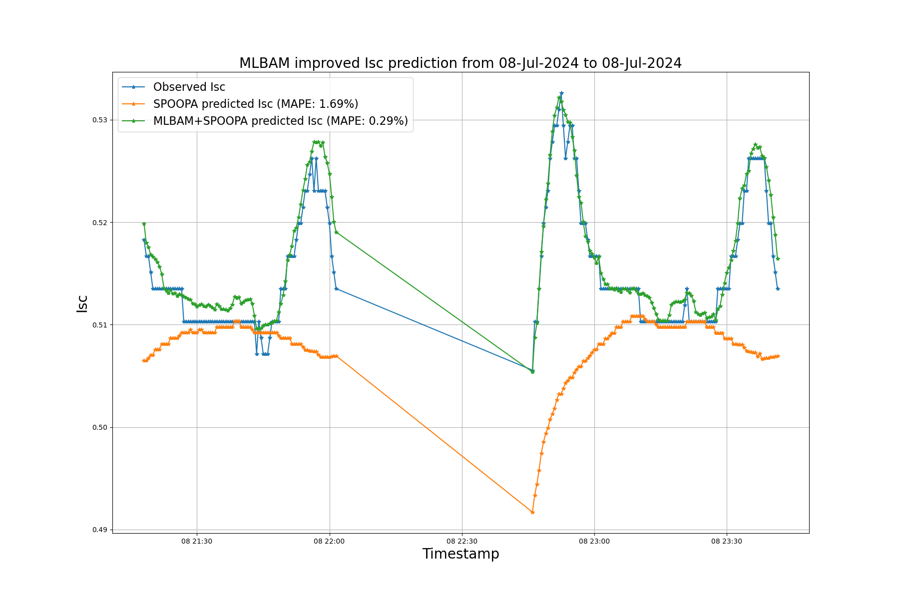

# MLBAM: ML-Based Albedo Modeling

**MLBAM (Machine Learning-Based Albedo Modeling)** is a comprehensive project that integrates advanced machine learning techniques to predict the impact of Earth’s albedo on solar cell performance, particularly focusing on Isc (short-circuit current). This repository builds on [SPOOPA](https://github.com/PrajjwalYash/spoopa), a project that uses comprehensive data science and domain knowledge integration to model the performance of solar cells in space. While SPOOPA focuses on space-based solar cell modeling, it does not consider the effect of Earth’s albedo. **MLBAM** fills this gap by employing machine learning models to estimate the albedo effect on Isc.

## Key Features
- **Data Preprocessing:** Handles solar panel data, including creating lagged features for historical data points.
- **Machine Learning Models:** Incorporates Random Forest, LightGBM, and other models to predict Isc and improve albedo modeling.
- **Visualization and Evaluation:** Provides detailed plots comparing predicted and observed Isc values, with latitude and longitude influencing marker color and size.
- **Performance Metrics:** Evaluates model performance using R², MAE, and MAPE for accurate predictions.
- **Time Series Prediction:** Includes functionality to forecast Isc over time using past performance data and machine learning models.

## Models Used
- **Random Forest Regressor**
- **LightGBM** (with GPU support)
- **Support Vector Regression (SVR)**
- **K-Nearest Neighbors (KNN)**

## Results
The implementation of MLBAM significantly improves the accuracy of Isc predictions by incorporating data-driven learning about albedo impact. The error in prediction of Isc reduces from **1.69%** to **0.29%** with MLBAM, demonstrating a notable improvement in the model's performance.

As shown in the plot above, the MLBAM model accurately predicts Isc values, with the majority of predictions closely matching the observed values.

## Contributors:
- **[Prajjwal Yash](https://github.com/PrajjwalYash)**
- **[Prachi Bisht](https://github.com/bisht-prachi)**
